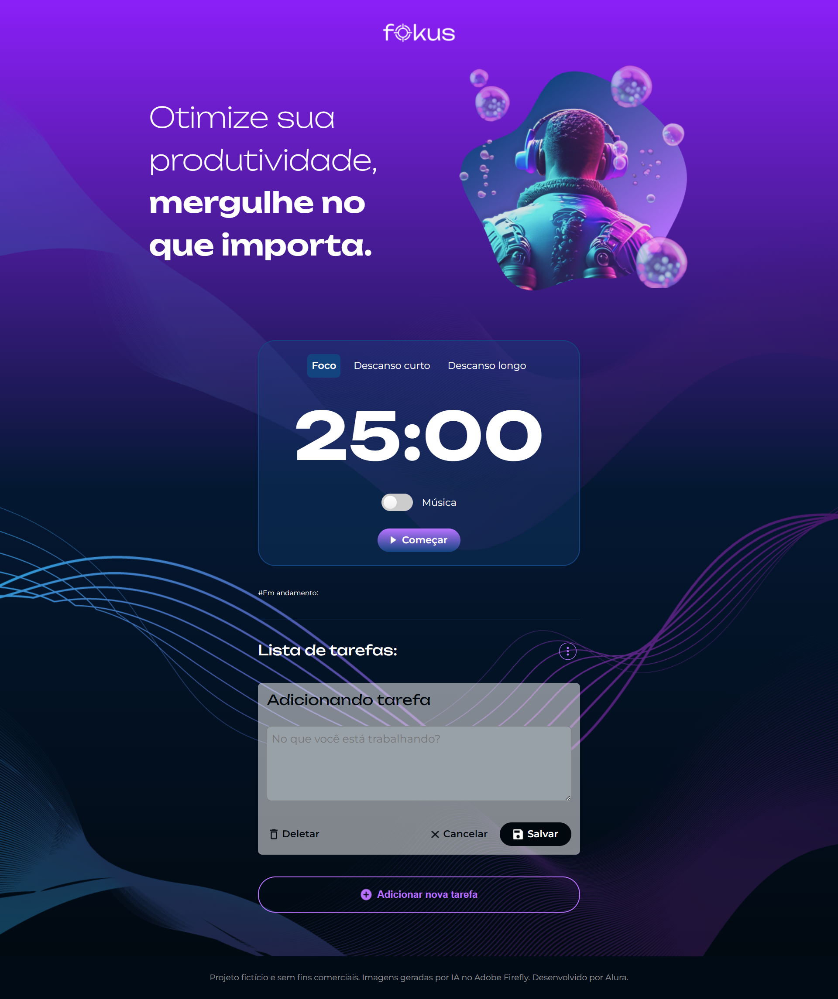

# Fokus

Fokus é uma aplicação web para ajudar na gestão de tempo, permitindo períodos de foco e pausas curtas ou longas. A aplicação é projetada para otimizar a produtividade, permitindo que você mergulhe no que importa.



## Conteúdo

- [Fokus](#fokus)
  - [Conteúdo](#conteúdo)
  - [Visão Geral](#visão-geral)
  - [Funcionalidades](#funcionalidades)
  - [Como Usar](#como-usar)
  - [Tecnologias Utilizadas](#tecnologias-utilizadas)
  - [Instalação](#instalação)

## Visão Geral

A aplicação Fokus foi desenvolvida como um projeto fictício e sem fins comerciais. Possui recursos para gerenciar períodos de foco, descansos curtos e descansos longos, otimizando sua rotina de trabalho.

## Funcionalidades

- Contagem regressiva para períodos de foco, descansos curtos e descansos longos.
- Alternância de música durante os períodos de foco.
- Lista de tarefas integrada para auxiliar no gerenciamento de atividades.

## Como Usar

1. Escolha entre os modos de Foco, Descanso Curto e Descanso Longo.
2. Ative ou desative a opção de música.
3. Clique em "Começar" para iniciar a contagem regressiva.
4. Acompanhe o tempo restante na tela.
5. Gerencie suas tarefas na seção de Lista de Tarefas.

## Tecnologias Utilizadas

- HTML
- CSS
- JavaScript


## Instalação

Clone o repositório e abra o arquivo `index.html` em seu navegador para usar a aplicação localmente.

```bash
git clone https://github.com/seu-usuario/fokus.git
cd fokus


